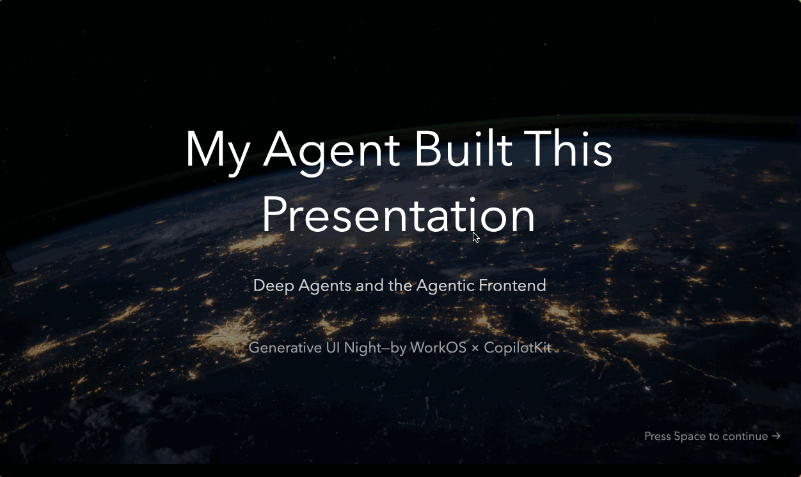

# Slidev Agent

Build [Slidev](https://sli.dev/) presentations with an agent in the loop.

`slidev-agent` combines a Slidev addon, a local wrapper CLI, and a LangChain-powered [Deep Agent](https://docs.langchain.com/oss/javascript/deepagents/overview) so you can draft, revise, review, and iterate on decks without leaving your presentation workflow.



## Why Slidev Agent

Writing slides is usually a context-switch marathon: edit markdown, jump to preview, tweak layout, re-run exports, then repeat. This project brings that loop together so an agent can work with your real deck files, understand the current slide, and help produce presentation-ready output inside a Slidev experience.

## What It Does

- Adds an in-deck agent UI to Slidev.
- Uses a LangChain Deep Agent to edit and organize Slidev decks on disk.
- Supports specialized slide-generation workflows through subagents.
- Exports screenshots for slide verification and visual review.

## Install In Your Own Deck

In a Slidev project, install the addon and LangGraph runtime:

```bash
# base setup
pnpm add slidev-addon-agent @slidev/cli vue @langchain/langgraph
# LLM provider
pnpm add @langchain/openai   # or @langchain/anthropic / @langchain/google
# optional: PNG screenshot verification during slide review
pnpm add -D playwright-chromium
```

You can swap `@langchain/openai` for `@langchain/anthropic` or `@langchain/google` depending on your model provider.

For the full installation and setup instructions, see [`packages/slidev-agent/README.md`](./packages/slidev-agent/README.md).