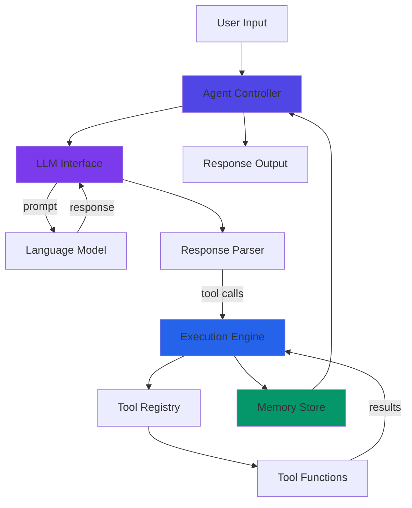
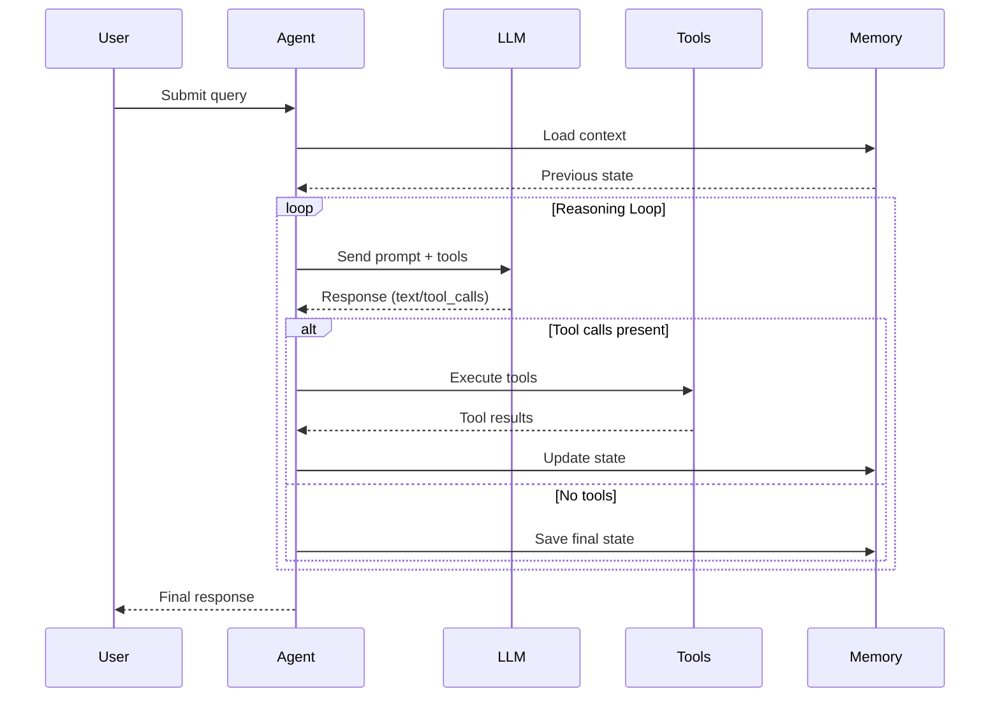
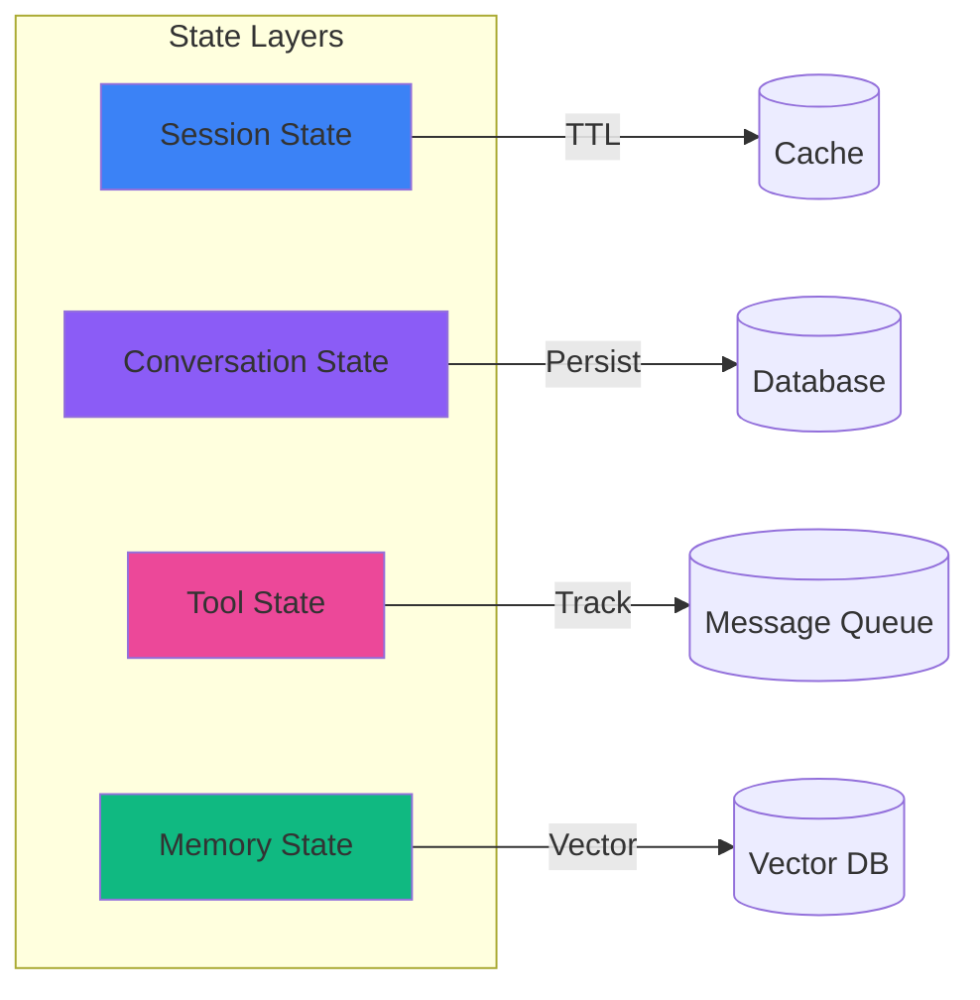
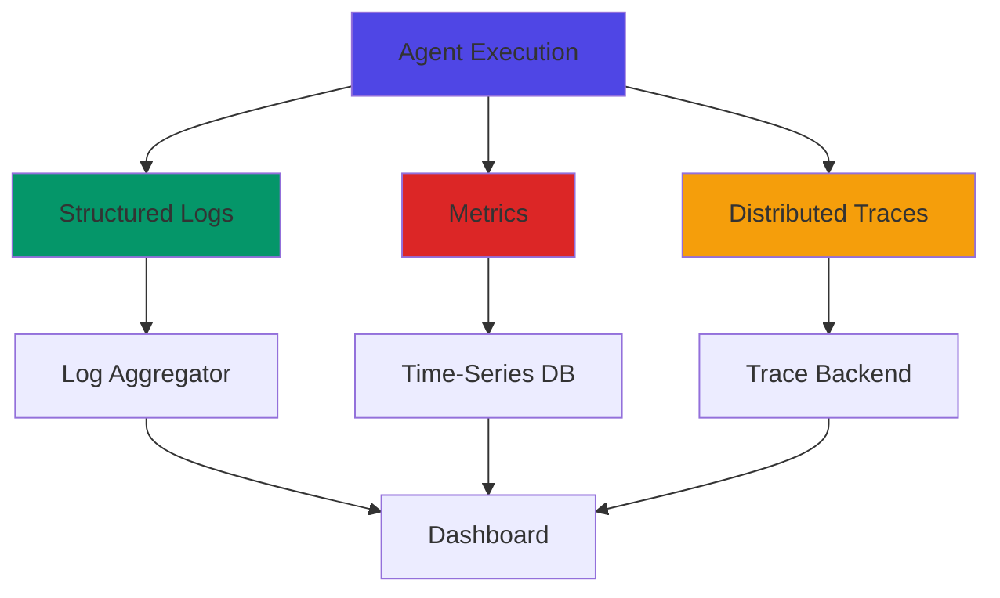

# Agent Architecture Patterns

Building Robust AI Agent Systems

<div class="text-gray-400 mt-4">
Core patterns for designing production-ready agents
</div>

<!--
Welcome to our deep dive into agent architecture patterns. In this section, we'll explore how to design and implement robust AI agent systems that can handle real-world production workloads.

We'll cover:
- Single-agent architectural patterns
- Execution flow and lifecycle management
- Input/output handling strategies
- State management approaches
- Error handling and retry mechanisms
- Observability and logging best practices

These patterns form the foundation for building reliable, maintainable, and scalable AI agent systems.
-->

---
layout: two-cols
---

# Single-Agent Architecture

<div class="text-sm">

## Core Components

- **Agent Controller**: Orchestrates execution
- **LLM Interface**: Handles model communication
- **Tool Registry**: Manages available tools
- **Memory Store**: Maintains context & state
- **Execution Engine**: Runs tool invocations

</div>

::right::



<!--
This diagram illustrates the single-agent architecture pattern - the most common and straightforward agent design.

The Agent Controller serves as the orchestrator, managing the overall flow. It receives user input and coordinates between components.

The LLM Interface abstracts away the specifics of model communication, handling prompt formatting, API calls, and response parsing. This separation allows you to swap models without changing core logic.

The Tool Registry maintains a catalog of available functions the agent can invoke. It handles tool discovery, validation, and execution delegation.

The Memory Store is crucial for maintaining conversation history and agent state across multiple turns. It can be implemented as in-memory storage for short sessions or backed by a database for persistence.

The Execution Engine takes tool calls from the LLM response and safely executes them, handling parameter validation, error catching, and result formatting.

This architecture provides clear separation of concerns and makes the system testable and maintainable.
-->

---

# Agent Execution Flow

<div class="grid grid-cols-2 gap-4">

<div>



</div>

<div class="text-sm">

## Execution Phases

**1. Initialization**
- Load conversation context
- Initialize tool registry
- Set up memory state

**2. Reasoning Loop**
- Send prompt to LLM
- Parse response
- Execute tool calls if present
- Update memory with results
- Repeat until done

**3. Finalization**
- Format final response
- Persist state changes
- Return to user

</div>

</div>

<!--
The agent execution flow follows a structured lifecycle that ensures consistent and reliable behavior.

The Initialization phase prepares the agent for execution. We load any relevant conversation history from memory, initialize the tool registry with available functions, and set up the initial state.

The core of the agent is the Reasoning Loop - this is where the magic happens. The agent sends the user's query along with available tools to the LLM. The model responds with either text or tool calls.

If tool calls are present, we execute them, gather results, and feed those back into the LLM for the next iteration. This loop continues until the agent determines it has enough information to provide a final answer.

This iterative approach allows agents to break down complex problems, gather necessary information through tools, and reason about the results before responding.

The Finalization phase ensures we properly format the response, persist any important state changes, and cleanly return control to the user.

One critical consideration is setting a maximum iteration count to prevent infinite loops if the agent gets stuck in a reasoning cycle.
-->

---
layout: two-cols
---

# I/O & State Management

<div class="text-sm">

## Input Handling

```python
class AgentInput:
    query: str
    context: dict
    tools: list[Tool]
    config: AgentConfig
    
class AgentConfig:
    max_iterations: int = 10
    temperature: float = 0.7
    timeout: int = 30
```

## Output Structure

```python
class AgentOutput:
    response: str
    tool_calls: list[ToolCall]
    tokens_used: int
    state: AgentState
```

</div>

::right::

<div class="text-sm">

## State Management



**State Types:**
- **Session**: User context, auth
- **Conversation**: Message history
- **Tool**: Execution results, cache
- **Memory**: Long-term knowledge

</div>

<!--
Input and output handling, along with state management, are critical for building reliable agents.

For Input Handling, we structure inputs as typed objects with clear contracts. The AgentInput includes the user query, any additional context, available tools, and configuration parameters. This structured approach makes validation easy and prevents errors.

The AgentConfig allows fine-tuning behavior - setting iteration limits prevents runaway loops, temperature controls creativity vs consistency, and timeouts ensure the system doesn't hang indefinitely.

Output Structure is equally important. The AgentOutput contains not just the response text, but metadata about tool calls made, tokens consumed, and the final state. This information is invaluable for debugging, billing, and analytics.

State Management operates at multiple layers, each with different persistence needs:

Session State includes user authentication, preferences, and request context. This is typically cached with a TTL and doesn't need long-term persistence.

Conversation State maintains the message history for the current interaction. This should be persisted to a database so conversations can resume after interruptions.

Tool State tracks execution results and can leverage caching to avoid redundant operations. A message queue can help manage asynchronous tool executions.

Memory State represents long-term knowledge the agent builds up. Vector databases are ideal here for semantic search over past interactions and learned information.

Choosing the right persistence strategy for each state layer balances performance with reliability.
-->

---

# Error Handling & Observability

<div class="grid grid-cols-2 gap-6">

<div class="text-sm">

## Error Handling Patterns

```python
class RetryStrategy:
    max_retries: int = 3
    backoff: str = "exponential"
    retry_on: list[Exception]

# Graceful degradation
try:
    result = agent.execute(query)
except LLMTimeout:
    result = fallback_response()
except ToolError as e:
    log_error(e)
    result = partial_response(e)
```

**Error Categories:**
- ⚡ **Transient**: Network, rate limits → Retry
- 🔧 **Tool errors**: Invalid params → Fallback
- 🤖 **LLM errors**: Parsing, timeouts → Retry/Cache
- 💥 **Fatal**: Auth, config → Fail fast

</div>

<div class="text-sm">

## Observability Stack



**Key Metrics:**
- Latency (p50, p95, p99)
- Token usage & cost
- Tool success rates
- Error rates by type

</div>

</div>

<!--
Error handling and observability are what separate toy agents from production-ready systems.

For Error Handling, we need to categorize errors and respond appropriately:

Transient errors like network issues or rate limits should trigger automatic retries with exponential backoff. These are temporary problems that often resolve themselves.

Tool errors might indicate invalid parameters or tool failures. Here, we can fall back to alternative approaches or ask the user for clarification rather than failing completely.

LLM errors can include parsing failures or timeouts. Caching previous successful responses and implementing retry logic helps maintain reliability.

Fatal errors like authentication failures or configuration issues should fail fast and loudly so they can be fixed immediately.

The RetryStrategy pattern codifies this logic, making retry behavior configurable and testable. Exponential backoff prevents hammering failing services, and specifying which exceptions to retry prevents infinite loops on unrecoverable errors.

For Observability, we need three pillars:

Structured Logs capture what happened - every tool call, every LLM request, every error. Use structured formats like JSON so logs are easily searchable and can feed into analytics pipelines.

Metrics tell you about system health in aggregate. Track latency percentiles to catch performance degradation, monitor token usage for cost control, measure tool success rates to identify problematic integrations, and track error rates by category to prioritize fixes.

Distributed Traces show the complete journey of a request through your system. This is invaluable for debugging complex multi-step agent executions where understanding the sequence and timing of operations is crucial.

Together, these observability tools give you the visibility needed to operate agents reliably in production. You can debug issues quickly, optimize performance, and ensure your agents meet SLAs.
-->
