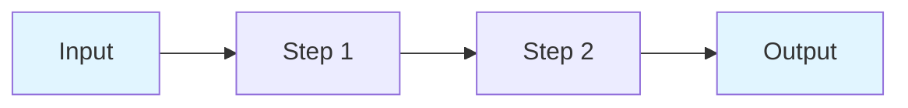
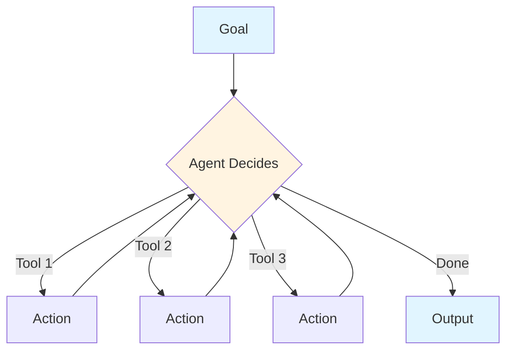
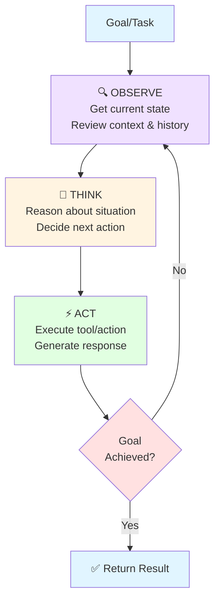
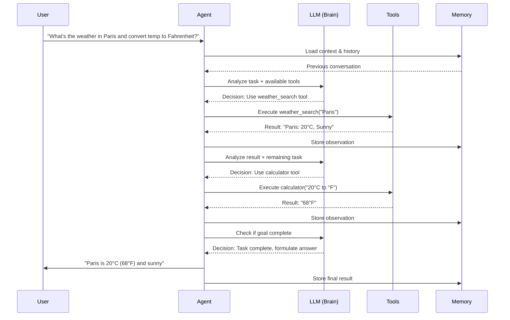

# Agent Concepts & Components

Understanding the fundamentals of AI agents

<!--
Welcome to the agent concepts section. In this part, we'll explore what makes agents different from traditional chains, understand the core agent loop, and examine the key components that make agents work.

Agents represent a shift from predetermined workflows to dynamic, goal-oriented systems that can adapt their behavior based on observations and feedback.
-->

---
layout: two-cols
---

# Agents vs Chains

<div class="text-sm">

## Traditional Chain 🔗
- **Fixed sequence** of operations
- Predetermined path A → B → C
- No runtime decision-making
- Predictable, repeatable
- Good for known workflows

```python
# Chain example
chain = prompt | llm | parser
result = chain.invoke(input)
# Always same steps
```

</div>

::right::

<div class="text-sm">

## Agent 🤖
- **Dynamic decision-making**
- Chooses actions at runtime
- Adapts based on observations
- Goal-oriented behavior
- Handles uncertainty

```python
# Agent example
agent = create_agent(llm, tools)
result = agent.invoke(goal)
# Agent decides which tools
# to use and when to stop
```

</div>

<div class="mt-8 text-center">



<div class="text-xs mt-2">Chain: Fixed Path</div>



<div class="text-xs mt-2">Agent: Dynamic Path</div>

</div>

<!--
The key difference: Chains are like following a recipe step-by-step, while agents are like a chef who tastes and adjusts as they cook.

Chains are predictable and efficient for well-defined tasks. Agents are flexible and can handle complex, multi-step problems where the path isn't clear from the start.

Think of chains as assembly lines and agents as problem solvers who choose their own tools.
-->

---
layout: default
---

# The Agent Loop

<div class="text-center mt-8">



</div>

<div class="mt-6 grid grid-cols-3 gap-4 text-sm">

<div class="border-l-4 border-purple-500 pl-3">

**Observe**
- Current state
- Tool outputs
- Memory/context
- User feedback

</div>

<div class="border-l-4 border-yellow-500 pl-3">

**Think**
- Analyze situation
- Plan next step
- Choose tool
- Reason about progress

</div>

<div class="border-l-4 border-green-500 pl-3">

**Act**
- Call selected tool
- Execute action
- Generate response
- Update state

</div>

</div>

<!--
The agent loop is the heart of agent behavior. It's a continuous cycle of observation, reasoning, and action.

OBSERVE: The agent gathers information about its current state - what has happened so far, what tools returned, what the user said.

THINK: Using the LLM, the agent reasons about what to do next. Should I search for information? Calculate something? Ask for clarification? Or am I done?

ACT: The agent executes its chosen action - calling a tool, returning a final answer, or asking a question.

This loop continues until the agent determines it has achieved its goal. The key insight is that the agent controls its own flow - it's not being told what to do at each step.
-->

---
layout: default
---

# Core Agent Components

<div class="grid grid-cols-2 gap-6 mt-8">

<div>

## 1. LLM (Brain) 🧠

The reasoning engine that powers decisions

```python
from langchain_openai import ChatOpenAI

llm = ChatOpenAI(
    model="gpt-4",
    temperature=0
)
# The "brain" that reasons
# about what to do next
```

<div class="text-sm mt-3 bg-blue-50 p-3 rounded">

**Role:** Decision-making, reasoning, understanding context, generating responses

</div>

</div>

<div>

## 2. Tools (Hands) 🛠️

Capabilities the agent can use

```python
from langchain.tools import Tool

tools = [
    Tool(
        name="Calculator",
        func=calculate,
        description="For math"
    ),
    Tool(
        name="Search",
        func=search,
        description="Find info"
    )
]
```

<div class="text-sm mt-3 bg-green-50 p-3 rounded">

**Role:** Extend agent capabilities beyond language - search, calculate, API calls, file operations

</div>

</div>

<div>

## 3. Memory (Context) 💾

Maintains conversation history

```python
from langchain.memory import (
    ConversationBufferMemory
)

memory = ConversationBufferMemory(
    return_messages=True
)
# Remembers past interactions
```

<div class="text-sm mt-3 bg-purple-50 p-3 rounded">

**Role:** Track conversation, maintain context, learn from past actions

</div>

</div>

<div>

## 4. Prompts (Instructions) 📝

Guide agent behavior

```python
system_prompt = """
You are a helpful assistant.
You have access to tools.
Think step-by-step and explain
your reasoning before acting.
"""
# Instructions that shape
# how the agent behaves
```

<div class="text-sm mt-3 bg-yellow-50 p-3 rounded">

**Role:** Define personality, reasoning style, constraints, output format

</div>

</div>

</div>

<!--
Let's break down the four essential components every agent needs:

1. LLM - The Brain: This is what gives the agent intelligence. It reads the current situation, understands the goal, and decides what to do next. Without the LLM, there's no agent - just tools.

2. Tools - The Hands: These are the agent's capabilities. An LLM alone can only generate text. Tools let it take action in the world - search the internet, do calculations, read files, call APIs. The agent chooses which tool to use based on its reasoning.

3. Memory - The Context: Agents need to remember what they've done and what they've learned. Memory keeps track of the conversation history and tool outputs so the agent doesn't repeat itself or forget important information.

4. Prompts - The Instructions: These are the rules and guidelines that shape how the agent behaves. Good prompts tell the agent to think step-by-step, explain its reasoning, and when to ask for help.

Together, these components create a system that can autonomously work toward goals.
-->

---
layout: default
---

# Agent Decision-Making Process

<div class="mt-4">



</div>

<div class="mt-4 text-sm bg-gray-50 p-4 rounded">

**Key Decision Points:**

1. **Tool Selection:** Agent chooses weather_search (not calculator or other tools)
2. **Action Sequencing:** Agent realizes it needs two steps and orders them correctly
3. **Termination:** Agent recognizes when the goal is achieved and stops

</div>

<!--
This sequence diagram shows how all the components work together in a real scenario.

Notice how the agent breaks down the complex request into multiple steps:
1. First, it recognizes it needs weather data and chooses the weather search tool
2. It gets the result and stores it in memory
3. Then it reasons that it still needs to convert the temperature
4. It chooses the calculator tool for the conversion
5. Finally, it determines the goal is complete and formulates a comprehensive answer

The LLM is making decisions at each step - which tool to use, whether the task is complete, and how to present the final answer.

Memory ensures the agent doesn't forget the weather data when it's doing the temperature conversion.

This is fundamentally different from a chain, where each step would be predetermined. The agent adapts its path based on the results it receives.
-->

---
layout: center
class: text-center
---

# Key Takeaways

<div class="text-left max-w-3xl mx-auto mt-8 space-y-4">

<v-clicks>

- 🔗 **Chains** are fixed sequences; **Agents** make dynamic decisions
  
- 🔄 **The Agent Loop**: Observe → Think → Act → Repeat until goal achieved
  
- 🧩 **Four Core Components**: LLM (brain), Tools (hands), Memory (context), Prompts (instructions)
  
- 🎯 **Agents are goal-oriented**: They decide their own path to achieve objectives
  
- ⚡ **Trade-offs**: Agents are more flexible but less predictable than chains

</v-clicks>

</div>

<!--
To wrap up this section:

Agents represent a paradigm shift in how we build LLM applications. Instead of hardcoding every step, we give the system goals and let it figure out how to achieve them.

The agent loop - observe, think, act - is inspired by how humans solve problems. We look at the situation, reason about it, take an action, and then reassess.

The four components work together: the LLM provides intelligence, tools provide capabilities, memory provides context, and prompts provide guidance.

Remember that agents aren't always the answer. For well-defined, predictable workflows, chains are simpler and more reliable. Use agents when you need flexibility and when the path to the solution isn't clear from the start.

Next, we'll explore different types of agent architectures and when to use each one.
-->
