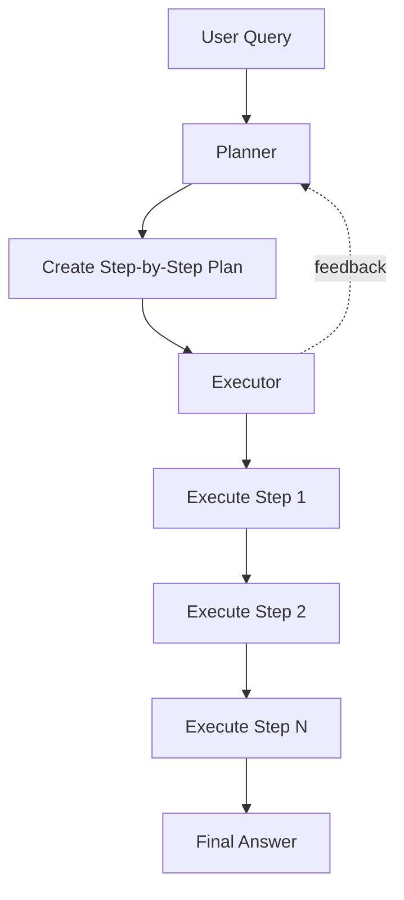

# Agent Types in LangChain

---

## Zero-Shot ReAct Agents

<div class="grid grid-cols-2 gap-4">
<div>

### Overview
- **ReAct** = Reasoning + Acting
- Makes decisions based on tool descriptions alone
- No examples needed (zero-shot)
- Uses chain-of-thought reasoning

### How It Works
1. Receives a query
2. Reasons about which tool to use
3. Takes action using the tool
4. Observes the result
5. Repeats until answer found

</div>
<div>

### Characteristics
- ✅ General purpose
- ✅ Works with any LLM
- ✅ Simple to set up
- ⚠️ May need strong reasoning models
- ⚠️ Can be verbose

### Best For
- General question answering
- Multi-tool scenarios
- When you have descriptive tool names
- Exploratory tasks

</div>
</div>

---

## Conversational & Specialized Agents

<div class="grid grid-cols-2 gap-4">
<div>

### Conversational Agents
- Maintains conversation memory
- Remembers previous interactions
- Uses chat history for context
- Great for chatbots

```python
from langchain.agents import AgentType

agent = initialize_agent(
    tools=tools,
    llm=llm,
    agent=AgentType.CONVERSATIONAL_REACT_DESCRIPTION,
    memory=memory
)
```

</div>
<div>

### OpenAI Functions Agents
- Uses OpenAI's function calling API
- More reliable and structured
- Reduced prompt injection risk
- Better tool selection accuracy

```python
agent = initialize_agent(
    tools=tools,
    llm=ChatOpenAI(),
    agent=AgentType.OPENAI_FUNCTIONS,
    verbose=True
)
```

</div>
</div>

<div class="mt-8">

### Structured Chat Agents
- Handles multi-input tools
- Better for complex tool schemas
- Uses structured output format
- More explicit parameter passing

</div>

---

## Plan-and-Execute Agents

<div class="grid grid-cols-2 gap-4">
<div>

### Architecture


</div>
<div>

### Advantages
- **Better for complex tasks**
  - Breaks down multi-step problems
  - More organized approach
  - Can revise plans mid-execution

- **Improved reliability**
  - Less prone to getting stuck
  - Better error recovery
  - More predictable behavior

### Use Cases
- Research tasks
- Data analysis workflows
- Multi-step reasoning
- Complex problem solving

</div>
</div>

---

## Agent Types Comparison

| Agent Type | Memory | Complexity | Speed | Best Use Case | LLM Requirements |
|------------|--------|------------|-------|---------------|------------------|
| **Zero-Shot ReAct** | ❌ | Low | Fast | General Q&A, simple tasks | Any (better with GPT-4) |
| **Conversational** | ✅ | Low | Fast | Chatbots, ongoing dialogs | Any |
| **OpenAI Functions** | ❌ | Medium | Fast | Reliable tool calling | OpenAI models only |
| **Structured Chat** | ✅ | Medium | Medium | Complex tool schemas | Strong reasoning models |
| **Plan-and-Execute** | ✅ | High | Slower | Research, multi-step tasks | Strong reasoning (GPT-4) |

<div class="mt-8 grid grid-cols-3 gap-4">
<div>

### 🎯 Accuracy
1. OpenAI Functions
2. Plan-and-Execute
3. Structured Chat
4. Zero-Shot ReAct
5. Conversational

</div>
<div>

### ⚡ Performance
1. Zero-Shot ReAct
2. OpenAI Functions
3. Conversational
4. Structured Chat
5. Plan-and-Execute

</div>
<div>

### 🛠️ Flexibility
1. Structured Chat
2. Plan-and-Execute
3. Conversational
4. Zero-Shot ReAct
5. OpenAI Functions

</div>
</div>

---

## When to Use Each Agent Type

<div class="grid grid-cols-2 gap-6">
<div>

### 🚀 Quick Start: Zero-Shot ReAct
```markdown
✓ You're just getting started
✓ Simple, straightforward tasks
✓ You have well-named tools
✓ Budget-friendly LLM usage
```

### 💬 User-Facing: Conversational
```markdown
✓ Building a chatbot
✓ Need conversation history
✓ Sequential interactions matter
✓ Personalized responses
```

### 🎯 Production: OpenAI Functions
```markdown
✓ Need reliability at scale
✓ Using OpenAI models
✓ Tool calling accuracy critical
✓ Want structured outputs
```

</div>
<div>

### 🔧 Complex Tools: Structured Chat
```markdown
✓ Tools need multiple inputs
✓ Complex parameter schemas
✓ Strict type requirements
✓ API integrations
```

### 🧠 Advanced Tasks: Plan-and-Execute
```markdown
✓ Multi-step reasoning needed
✓ Research or analysis tasks
✓ Complex problem decomposition
✓ Error recovery important
✓ Have budget for GPT-4
```

### 💡 Pro Tip
Start simple with Zero-Shot ReAct, then upgrade based on specific needs. Most applications don't need Plan-and-Execute complexity!

</div>
</div>
