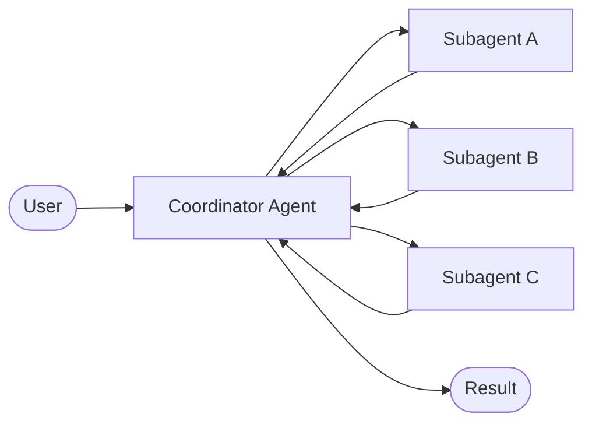

# Architecture at a Glance

How Deep Agents orchestrates work

  <!-- The Stack -->
  

    
The Stack

    

      

        
LangChain Core

        
↓

        
LangGraph

        
↓

        
LangChain

        
↓

        
Deep Agents

      

    

  

  <!-- Mermaid flowchart -->
  

    
Orchestration Flow

    

  

  

  <!-- Value prop -->
  

    
Why It Matters

    

      

        Handles <strong>complex multi-step tasks</strong>, manages <strong>large context</strong>, runs <strong>interactively</strong> or <strong>non-interactively</strong>
      

    

  

