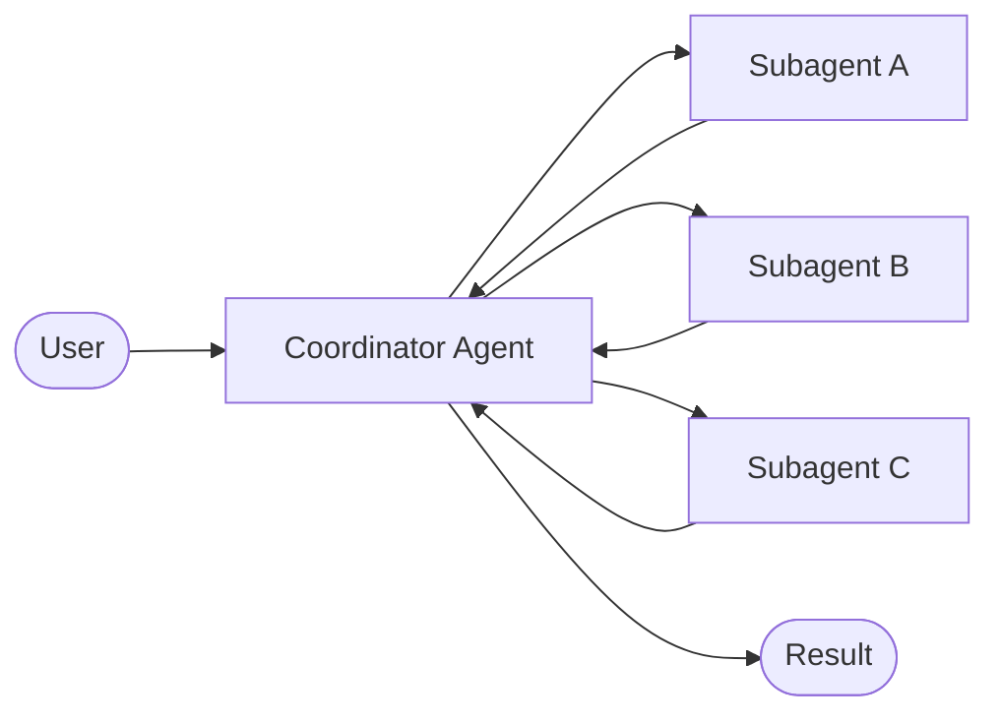

# What is Deep Agents?

A JavaScript/TypeScript SDK built on top of LangChain + LangGraph

  An "agent harness" — baked-in capabilities so you wire nothing up from scratch.

  🧠 Planning
  System prompts that teach the model to <strong>plan before acting</strong>

  🤖 Subagents
  Coordinator-worker for <strong>parallel work</strong>

  💾 Memory
  <strong>Persistent memory</strong> across sessions

  📁 File System
  Pluggable <strong>context management</strong>

  🙋 Human Loop
  Composable <strong>per-tool approval</strong>

  🔒 Sandboxes
  <strong>Secure</strong> execution environments

::right::

  
The Stack

  

    
LangChain Core

    
↓

    
LangGraph

    
↓

    
LangChain

    
↓

    
Deep Agents

  

  Handles <strong>complex multi-step tasks</strong>, manages <strong>large context</strong>, runs <strong>interactively</strong> or <strong>non-interactively</strong>

