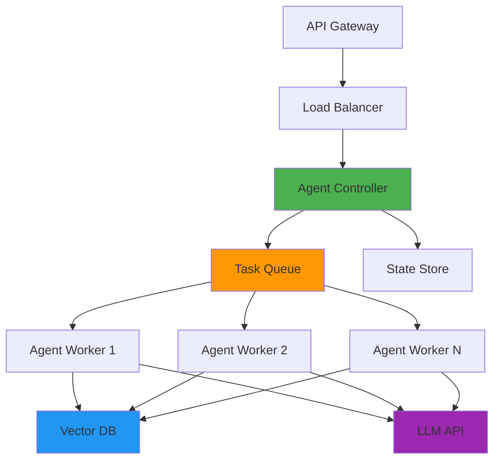

# Deployment & Production
Building robust agent systems at scale

---
layout: two-cols
---

# Deployment Architectures

<v-clicks>

### Serverless Pattern
- **AWS Lambda / Cloud Functions**
- Event-driven, auto-scaling
- Cost-effective for variable load
- Cold start considerations

### Container-Based
- **Docker + Kubernetes**
- Consistent environments
- Horizontal scaling with replicas
- Better for stateful agents

</v-clicks>

::right::

<v-clicks>

### Hybrid Architecture


**Key Components:**
- Async task processing
- Shared state management
- Connection pooling

</v-clicks>

---

# Scaling Agent Systems

<v-clicks depth="2">

### Horizontal Scaling Strategies

- **Stateless Agents**: Scale workers independently
  - Use external state stores (Redis, DynamoDB)
  - Session affinity not required
  - Easy auto-scaling based on queue depth

- **Rate Limiting & Throttling**
  - Token bucket algorithms
  - Per-user and system-wide limits
  - Backpressure handling

- **Caching Layers**
  ```python
  from langchain.cache import RedisCache
  from langchain.globals import set_llm_cache
  
  # Cache LLM responses
  set_llm_cache(RedisCache(redis_url="redis://localhost:6379"))
  
  # Cache embeddings for frequent queries
  embeddings = CachedEmbeddings(underlying=OpenAIEmbeddings())
  ```

</v-clicks>

---

# Monitoring & Observability

<v-clicks depth="2">

### Essential Metrics to Track

1. **Performance Metrics**
   - Latency (p50, p95, p99)
   - Token usage per request
   - Cost per interaction
   - Cache hit rates

2. **Quality Metrics**
   - Task success rate
   - Tool call accuracy
   - User satisfaction scores
   - Error rates by category

3. **System Health**
   ```python
   from prometheus_client import Counter, Histogram, Gauge
   
   agent_requests = Counter('agent_requests_total', 'Total agent requests')
   agent_latency = Histogram('agent_latency_seconds', 'Agent response time')
   active_agents = Gauge('active_agents', 'Number of active agent instances')
   llm_tokens = Counter('llm_tokens_total', 'Total tokens consumed', ['model'])
   ```

</v-clicks>

---
layout: two-cols
---

# LangSmith for Tracing

<v-clicks>

### Production Tracing Setup

```python
import os
from langsmith import Client

# Enable tracing
os.environ["LANGCHAIN_TRACING_V2"] = "true"
os.environ["LANGCHAIN_ENDPOINT"] = "https://api.smith.langchain.com"
os.environ["LANGCHAIN_API_KEY"] = "your-api-key"
os.environ["LANGCHAIN_PROJECT"] = "production-agents"

# Add metadata
from langchain.callbacks import tracing_v2_enabled

with tracing_v2_enabled(
    project_name="prod",
    tags=["critical-path"],
    metadata={"user_id": "123", "version": "2.0"}
):
    result = agent.invoke({"input": user_query})
```

</v-clicks>

::right::

<v-clicks>

### Key LangSmith Features

- **Full execution traces**
  - Every LLM call
  - Tool invocations
  - Chain execution flow

- **Debugging capabilities**
  - Replay failed runs
  - Compare different prompts
  - A/B test agent versions

- **Analytics dashboard**
  - Cost breakdowns
  - Latency analysis
  - Error patterns

<div class="mt-4 p-4 bg-blue-50 rounded">
<carbon-warning class="text-blue-600" /> 

**Tip**: Use sampling in production (e.g., 10% of traces) to reduce overhead
</div>

</v-clicks>

---

# Production Best Practices

<v-clicks depth="2">

### 1. Robust Error Handling
```python
from tenacity import retry, stop_after_attempt, wait_exponential

@retry(stop=stop_after_attempt(3), wait=wait_exponential(multiplier=1, min=4, max=10))
async def call_agent_with_retry(input_data):
    try:
        return await agent.ainvoke(input_data)
    except RateLimitError:
        # Switch to fallback model
        return await fallback_agent.ainvoke(input_data)
    except Exception as e:
        logger.error(f"Agent error: {e}", extra={"input": input_data})
        raise
```

### 2. Timeout Management
- Set strict timeouts for LLM calls (30-60s)
- Implement graceful degradation
- Use circuit breakers for external services

### 3. Security Measures
- Input sanitization and validation
- Output filtering for sensitive data
- API key rotation and secrets management
- Audit logging for compliance

</v-clicks>

---

# Common Pitfalls to Avoid

<v-clicks>

<div class="grid grid-cols-2 gap-4">

<div class="p-4 bg-red-50 rounded">
<carbon-close-filled class="text-red-600" />

### ❌ Don't Do This
- **No streaming**: Buffer entire response
- **Synchronous blocking**: Wait for all tools
- **Single point of failure**: One LLM provider
- **Unbounded context**: Keep growing history
- **No cost controls**: Unlimited token usage
- **Missing fallbacks**: No error recovery
</div>

<div class="p-4 bg-green-50 rounded">
<carbon-checkmark-filled class="text-green-600" />

### ✅ Do This Instead
- **Stream responses**: Show progress incrementally
- **Async operations**: Parallel tool execution
- **Multi-provider setup**: AWS + OpenAI + Azure
- **Sliding window**: Summarize old context
- **Budget limits**: Per-user token quotas
- **Graceful degradation**: Simpler fallback agents
</div>

</div>

### Architecture Anti-patterns
- Storing state in memory (use Redis/DB)
- Hardcoded prompts (use version control)
- No monitoring until production issues arise
- Over-engineering before validating use case

</v-clicks>

---
layout: two-cols
---

# Future of Agent Systems

<v-clicks>

### Emerging Trends (2024-2025)

**1. Multi-Agent Orchestration**
- Specialized agents working together
- Dynamic team formation
- Agent marketplaces

**2. Enhanced Autonomy**
- Long-running background agents
- Self-improvement through feedback
- Continuous learning systems

**3. Better Tooling**
- Visual agent builders
- Auto-generated tools from APIs
- Standardized agent protocols

</v-clicks>

::right::

<v-clicks>

**4. Cost Optimization**
```python
# Smaller models for routing
router = ChatOpenAI(model="gpt-4o-mini")
# Powerful model for complex tasks
executor = ChatOpenAI(model="gpt-4o")

# Model cascading
if complexity_score < 0.5:
    result = lightweight_agent.invoke(task)
else:
    result = advanced_agent.invoke(task)
```

**5. Regulatory & Safety**
- AI agent governance frameworks
- Explainable agent decisions
- Human-in-the-loop requirements

### What to Prepare For
- More sophisticated orchestration
- Better observability needs
- Hybrid human-agent workflows

</v-clicks>

---
layout: center
class: text-center
---

# Ready to Deploy? 🚀

<div class="text-xl mt-8">

**Key Takeaways**
- Choose architecture based on your scale
- Monitor everything from day one
- Build in fallbacks and error handling
- Use LangSmith for production debugging
- Start simple, scale deliberately

</div>

<div class="mt-12 text-gray-500">
Questions? Let's discuss deployment strategies for your use case.
</div>
