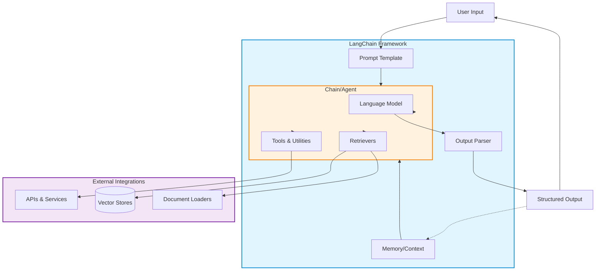

# LangChain Fundamentals

Building LLM-Powered Applications with LangChain

<div class="abs-br m-6 flex gap-2">
  <button @click="$slidev.nav.next" class="px-2 py-1 rounded cursor-pointer" hover="bg-white bg-opacity-10">
    Press Space for next slide <carbon:arrow-right class="inline"/>
  </button>
</div>

<!--
LangChain is a powerful framework for developing applications powered by language models. It provides a comprehensive toolkit for building everything from simple chatbots to complex AI agents.

Key points to cover:
- LangChain simplifies LLM application development
- Provides standardized interfaces and abstractions
- Enables complex workflows with composable components
-->

---
layout: default
---

# What is LangChain?

<v-clicks>

- **Framework for developing LLM-powered applications**
  - Simplifies integration with various LLM providers (OpenAI, Anthropic, Hugging Face, etc.)
  - Provides standardized interfaces for common patterns

- **Key Features**
  - 🔗 **Composable** - Build complex applications from simple components
  - 🔌 **Modular** - Use only what you need, extend what you want
  - 🌐 **Ecosystem** - Rich set of integrations and tools
  - 📚 **Memory** - Built-in conversation and context management

- **Design Philosophy**
  - Data-aware: Connect language models to data sources
  - Agentic: Allow models to interact with their environment
  - Observable: Built-in logging and debugging capabilities

</v-clicks>

<!--
LangChain was created to solve the common challenges developers face when building LLM applications:

1. Multiple provider integrations - LangChain abstracts away the differences between OpenAI, Anthropic, and other providers
2. Complex workflows - Makes it easy to chain multiple LLM calls together
3. Context management - Handles conversation history and memory automatically
4. Tool integration - Simplifies giving LLMs access to external tools and APIs

The framework has grown into a comprehensive ecosystem with both Python and JavaScript/TypeScript implementations.
-->

---
layout: two-cols
---

# Core Components

<v-clicks>

## 1. Models / LLMs
- Language model interfaces
- Chat models, LLMs, embeddings
- Provider-agnostic abstractions

## 2. Prompts
- Prompt templates
- Few-shot examples
- Output parsers

## 3. Chains
- Sequential operations
- Combine LLMs with utilities
- Reusable workflows

</v-clicks>

::right::

<v-clicks>

## 4. Memory
- Conversation history
- Context persistence
- Different storage backends

## 5. Agents
- Dynamic decision making
- Tool selection and execution
- Reasoning loops

## 6. Retrievers
- Document loading
- Vector stores
- Semantic search

</v-clicks>

<!--
Let's break down each core component:

**Models**: These are wrappers around different LLM providers. LangChain provides a unified interface whether you're using GPT-4, Claude, or open-source models.

**Prompts**: Instead of hardcoding prompts, LangChain uses templates that can be reused and parameterized. Output parsers help structure the LLM's response.

**Chains**: The fundamental building block. A chain combines an LLM with other components to create a workflow. For example, a simple chain might format a prompt, call an LLM, and parse the output.

**Memory**: Critical for chatbots and conversational apps. LangChain provides several memory types - buffer memory (stores all messages), summary memory (summarizes old messages), and more.

**Agents**: The most powerful component. Agents can decide which tools to use and in what order to accomplish a task. They create a reasoning loop.

**Retrievers**: Handle the "data-aware" part of LangChain. Load documents, split them into chunks, create embeddings, and enable semantic search.
-->

---
layout: default
---

# LangChain Architecture

<div class="flex justify-center items-center h-100">



</div>

<!--
This architecture diagram shows how data flows through a LangChain application:

1. **User Input** comes in and is formatted using a **Prompt Template**
2. The prompt combines with **Memory/Context** (previous conversation history)
3. Inside the **Chain/Agent**, the system decides how to proceed:
   - Calls the **Language Model** with the formatted prompt
   - May invoke **Tools** to interact with external APIs
   - May query **Retrievers** to fetch relevant documents from vector stores
4. The LLM's response goes through an **Output Parser** to structure the data
5. The structured output returns to the user
6. The interaction is saved to **Memory** for future context

Key architectural principles:
- **Separation of concerns**: Each component has a clear responsibility
- **Composability**: Components can be mixed and matched
- **Extensibility**: Easy to add new tools, retrievers, or memory types
- **Observability**: Each step can be logged and monitored
-->

---
layout: two-cols
---

# Key Abstractions

<v-clicks>

## Runnables
```python
# Everything is a Runnable
chain = prompt | model | parser

# Invoke synchronously
result = chain.invoke(input)

# Stream responses
for chunk in chain.stream(input):
    print(chunk)

# Batch processing
results = chain.batch([
    input1, input2, input3
])
```

## LCEL (LangChain Expression Language)
```python
# Compose with | operator
chain = (
    {"context": retriever, 
     "question": RunnablePassthrough()}
    | prompt
    | model
    | StrOutputParser()
)
```

</v-clicks>

::right::

<v-clicks>

## Design Principles

### 1. **Composability**
- Small, focused components
- Easy to chain together
- Unix philosophy applied to LLMs

### 2. **Standardization**
- Consistent interfaces
- Provider-agnostic code
- Easy to swap implementations

### 3. **Observability**
- Built-in callbacks
- Tracing and logging
- LangSmith integration

### 4. **Production-Ready**
- Error handling
- Retry logic
- Async support

</v-clicks>

<!--
LangChain's key abstractions make it powerful and flexible:

**Runnables** - The LCEL (LangChain Expression Language) interface that everything implements. This gives you:
- invoke() for single inputs
- stream() for streaming responses
- batch() for processing multiple inputs
- Async versions of all methods

**Composability with |** - The pipe operator lets you chain components together in a readable way, similar to Unix pipes. Each component's output becomes the next component's input.

**Design Principles**:

1. **Composability** - Build complex applications from simple, reusable pieces. A RAG application might compose: retriever | prompt | model | parser

2. **Standardization** - Whether you use OpenAI or Anthropic, the code looks the same. Just swap the model component.

3. **Observability** - LangSmith and callbacks let you see exactly what's happening at each step, crucial for debugging and optimization.

4. **Production-Ready** - Built-in retry logic, error handling, rate limiting, and async support mean your prototype can scale to production.
-->

---
layout: default
---

# Integration Ecosystem

<div class="grid grid-cols-2 gap-8 mt-8">

<div v-click>

### LLM Providers
- **OpenAI** - GPT-4, GPT-3.5, Embeddings
- **Anthropic** - Claude 2, Claude Instant
- **Google** - PaLM, Vertex AI
- **Hugging Face** - Open-source models
- **Cohere** - Command, Embed
- **Azure OpenAI** - Enterprise deployments

</div>

<div v-click>

### Vector Stores
- **Pinecone** - Managed vector DB
- **Weaviate** - Open-source vector search
- **Chroma** - Embedded vector DB
- **FAISS** - Facebook similarity search
- **Qdrant** - Vector search engine
- **Milvus** - Cloud-native vector DB

</div>

<div v-click>

### Tools & Utilities
- **Search** - Google, Bing, DuckDuckGo
- **APIs** - REST, GraphQL
- **Databases** - SQL, NoSQL
- **Python REPL** - Code execution
- **Web** - Browsing, scraping
- **Math** - Calculations, Wolfram Alpha

</div>

<div v-click>

### Document Loaders
- **PDF** - PyPDF, PDFMiner
- **Web** - Beautiful Soup, Playwright
- **Databases** - MongoDB, PostgreSQL
- **Cloud** - S3, GCS, Azure Blob
- **Office** - Word, Excel, PowerPoint
- **Code** - GitHub, GitLab, Bitbucket

</div>

</div>

<div v-click class="mt-8 p-4 bg-blue-50 dark:bg-blue-900 rounded">

💡 **Quick Start**: `pip install langchain langchain-openai` or `npm install langchain`

</div>

<!--
LangChain's strength lies in its extensive integration ecosystem:

**LLM Providers** - Support for all major providers means you can:
- Start with OpenAI for prototyping
- Switch to Azure OpenAI for enterprise compliance
- Use open-source models for cost optimization
- Mix providers (e.g., GPT-4 for reasoning, cheaper models for simple tasks)

**Vector Stores** - Essential for RAG applications:
- Pinecone for fully managed, scalable solution
- Chroma for local development and testing
- FAISS for in-memory similarity search
- Choose based on scale, budget, and deployment requirements

**Tools** - Give agents superpowers:
- Search tools for up-to-date information
- Python REPL for calculations and data analysis
- API tools for interacting with external services
- Web tools for browsing and scraping

**Document Loaders** - Ingest data from anywhere:
- PDF loaders for processing documentation
- Web loaders for scraping knowledge bases
- Database loaders for connecting to existing data
- Cloud loaders for enterprise data sources

The ecosystem is constantly growing with community contributions. Check the LangChain documentation for the latest integrations.

Getting started is simple - install the core package and any integrations you need!
-->
