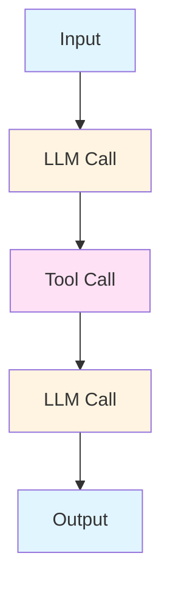
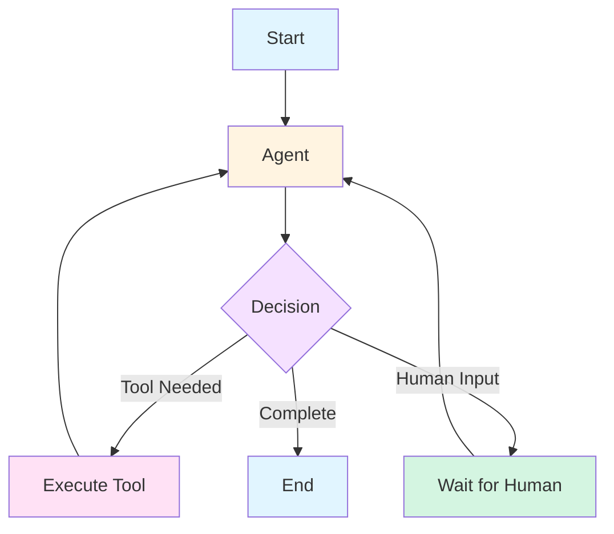
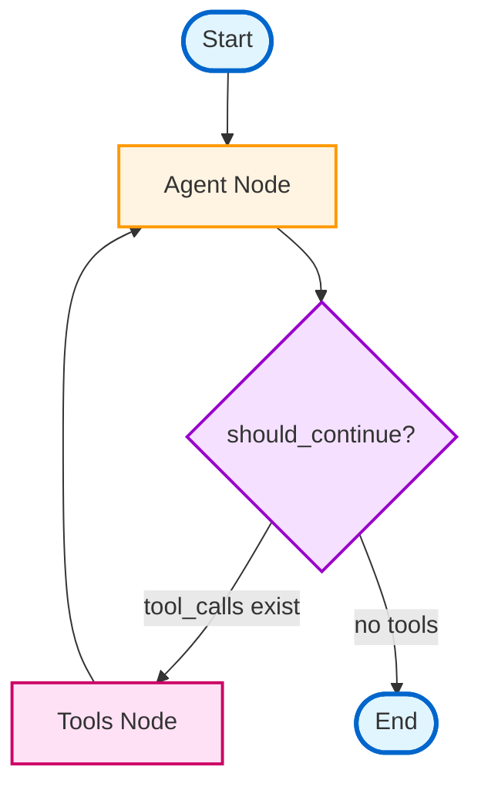
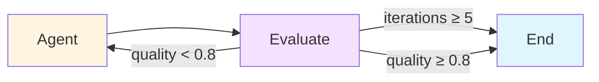
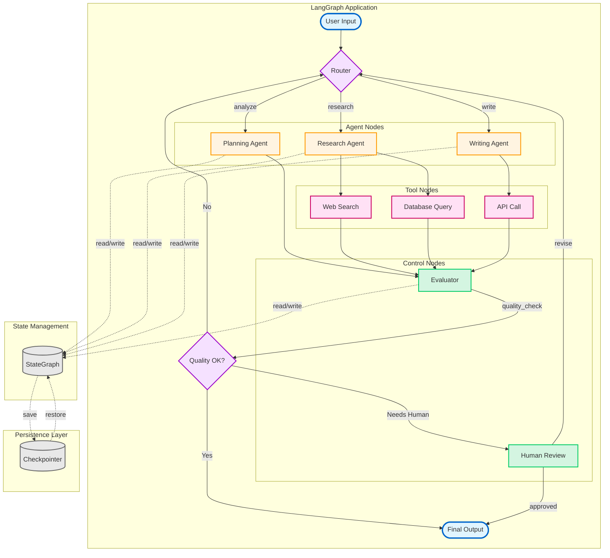

# LangGraph for Advanced Workflows

<div class="text-center">

## Building Intelligent Multi-Agent Systems

<div class="mt-8">

**LangGraph** is a framework for building stateful, multi-actor applications with LLMs

</div>

</div>

<div class="mt-12 grid grid-cols-2 gap-8">

<div>

### Why LangGraph?

- 🔄 **Cyclic workflows** beyond linear chains
- 🎯 **State management** for complex agents
- 🤝 **Human-in-the-loop** capabilities
- 🌊 **Flexible control flow** with conditional routing
- 📊 **Graph-based execution** for clarity

</div>

<div>

### Use Cases

- Multi-step reasoning agents
- Iterative refinement workflows
- Tool-calling with retry logic
- Collaborative multi-agent systems
- Complex decision-making pipelines

</div>

</div>

---

# Graph-Based Agent Execution

<div class="grid grid-cols-2 gap-8">

<div>

## Traditional Chains



<div class="text-sm mt-4">

❌ Linear flow only  
❌ Hard to add loops  
❌ Limited error handling  

</div>

</div>

<div>

## LangGraph



<div class="text-sm mt-4">

✅ Cyclic workflows  
✅ Conditional routing  
✅ Flexible control flow  

</div>

</div>

</div>

---

# StateGraph: The Core Abstraction

<div class="grid grid-cols-2 gap-6">

<div>

## Defining State

```python
from typing import TypedDict, Annotated
from langgraph.graph import StateGraph
from operator import add

class AgentState(TypedDict):
    messages: Annotated[list, add]
    current_step: str
    iterations: int
    final_answer: str | None

# Create graph with state
graph = StateGraph(AgentState)
```

<div class="mt-4 text-sm bg-blue-50 p-3 rounded">

**State** persists across nodes and tracks execution progress

</div>

</div>

<div>

## Key Concepts

### **Nodes** 🔵
Functions that process state
```python
def agent_node(state: AgentState):
    # Process state
    return {"current_step": "reasoning"}
```

### **Edges** ➡️
Connect nodes (static routing)
```python
graph.add_edge("node_a", "node_b")
```

### **Conditional Edges** 🔀
Dynamic routing based on state
```python
graph.add_conditional_edges(
    "agent",
    should_continue,  # Router function
    {
        "continue": "tools",
        "end": END
    }
)
```

</div>

</div>

---

# Building a LangGraph Workflow

<div class="grid grid-cols-2 gap-6">

<div>

## Step-by-Step Example

```python {all|1-5|7-9|11-14|16-19|21-24|26-29|all}
from langgraph.graph import StateGraph, END
from langgraph.prebuilt import ToolExecutor

# 1. Define nodes
def call_agent(state):
    response = llm.invoke(state["messages"])
    return {"messages": [response]}

def call_tools(state):
    tool_executor.invoke(
        state["messages"][-1].tool_calls
    )
    return {"messages": [tool_result]}

# 2. Create graph
graph = StateGraph(AgentState)
graph.add_node("agent", call_agent)
graph.add_node("tools", call_tools)

# 3. Add conditional routing
def should_continue(state):
    last = state["messages"][-1]
    return "tools" if last.tool_calls else "end"

graph.add_conditional_edges(
    "agent",
    should_continue,
    {"tools": "tools", "end": END}
)

# 4. Set entry and compile
graph.set_entry_point("agent")
graph.add_edge("tools", "agent")
app = graph.compile()
```

</div>

<div>

## Execution Flow



<div class="mt-6">

### Key Features

- **Cyclic**: Tools → Agent loop
- **Conditional**: Router decides path
- **Stateful**: Messages accumulate
- **Flexible**: Easy to extend

</div>

</div>

</div>

---

# Advanced Features

<div class="grid grid-cols-2 gap-6">

<div>

## Human-in-the-Loop

```python
from langgraph.checkpoint import MemorySaver

# Enable persistence
memory = MemorySaver()
app = graph.compile(checkpointer=memory)

# Run until interrupt
config = {"configurable": {"thread_id": "1"}}
for event in app.stream(inputs, config):
    if event.get("needs_human"):
        break  # Pause for human input

# Resume after human input
app.invoke(
    {"human_response": "Approved"},
    config
)
```

<div class="mt-4 bg-green-50 p-3 rounded text-sm">

✅ Pause execution for approvals  
✅ Persist state across sessions  
✅ Resume from checkpoints  

</div>

</div>

<div>

## Cyclic Workflows

```python
def should_continue(state):
    if state["iterations"] >= 5:
        return "end"
    if state["quality_score"] < 0.8:
        return "refine"
    return "end"

graph.add_conditional_edges(
    "evaluate",
    should_continue,
    {
        "refine": "agent",  # Loop back
        "end": END
    }
)
```

<div class="mt-4">



</div>

<div class="mt-2 text-sm bg-purple-50 p-3 rounded">

**Iterative refinement** until quality threshold or max iterations

</div>

</div>

</div>

---

# LangGraph vs Traditional Agents

<div class="grid grid-cols-2 gap-6">

<div>

## Traditional Agents (LangChain)

```python
from langchain.agents import AgentExecutor

agent = create_react_agent(
    llm, tools, prompt
)

executor = AgentExecutor(
    agent=agent,
    tools=tools,
    max_iterations=10
)

result = executor.invoke({"input": query})
```

### Limitations

- ❌ Fixed execution pattern
- ❌ Limited control flow
- ❌ Hard to customize loops
- ❌ No built-in state persistence
- ❌ Difficult multi-agent coordination

</div>

<div>

## LangGraph Agents

```python
from langgraph.prebuilt import create_react_agent

graph = StateGraph(AgentState)

# Full control over each step
graph.add_node("planner", plan_step)
graph.add_node("executor", execute_step)
graph.add_node("evaluator", evaluate_step)

# Custom routing logic
graph.add_conditional_edges(...)

app = graph.compile(
    checkpointer=MemorySaver()
)
```

### Advantages

- ✅ Explicit graph structure
- ✅ Flexible control flow
- ✅ Easy cyclic workflows
- ✅ Built-in checkpointing
- ✅ Multi-agent orchestration
- ✅ Human-in-the-loop support

</div>

</div>

---

# LangGraph Architecture Diagram



<div class="mt-4 grid grid-cols-4 gap-2 text-xs">
<div class="bg-blue-100 p-2 rounded">🔵 Entry/Exit Points</div>
<div class="bg-orange-100 p-2 rounded">🟠 Agent Nodes</div>
<div class="bg-pink-100 p-2 rounded">🔴 Tool Nodes</div>
<div class="bg-green-100 p-2 rounded">🟢 Control Nodes</div>
</div>

---

# Key Takeaways

<div class="grid grid-cols-2 gap-8">

<div>

## When to Use LangGraph

✅ **Multi-step reasoning** with iteration  
✅ **Complex control flow** beyond chains  
✅ **Human-in-the-loop** workflows  
✅ **Multi-agent collaboration**  
✅ **Stateful conversations** with memory  
✅ **Error handling** with retry logic  

<div class="mt-6 bg-blue-50 p-4 rounded">

### Best For

- Research assistants with iterative refinement
- Code generation with testing loops
- Customer support with escalation paths
- Data analysis with validation steps

</div>

</div>

<div>

## Core Concepts Recap

```python
# 1. Define state schema
class State(TypedDict):
    messages: list
    context: dict

# 2. Create graph
graph = StateGraph(State)

# 3. Add nodes (processing units)
graph.add_node("node_name", function)

# 4. Add edges (routing)
graph.add_edge("a", "b")  # Static
graph.add_conditional_edges(  # Dynamic
    "a", router_fn, mapping
)

# 5. Compile with features
app = graph.compile(
    checkpointer=MemorySaver(),
    interrupt_before=["human_review"]
)

# 6. Execute
result = app.invoke(input, config)
```

</div>

</div>

<div class="mt-8 text-center text-xl">

🚀 **LangGraph enables production-grade agent applications with full control**

</div>
