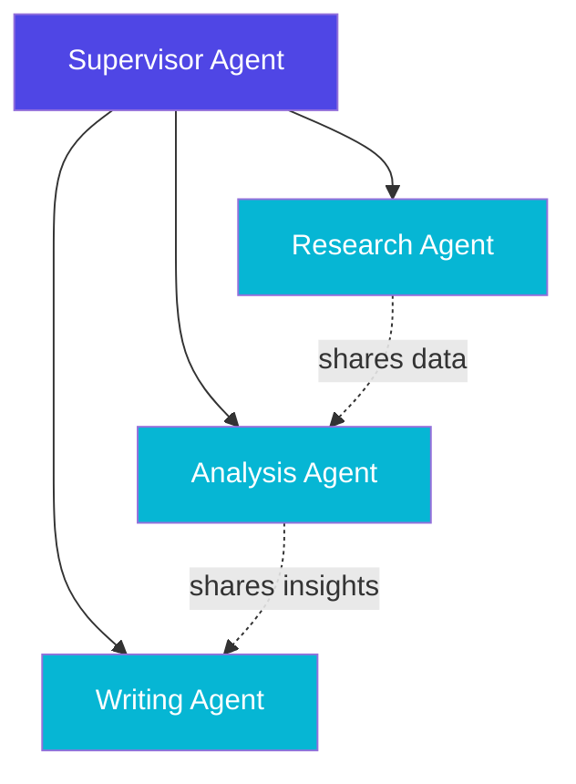
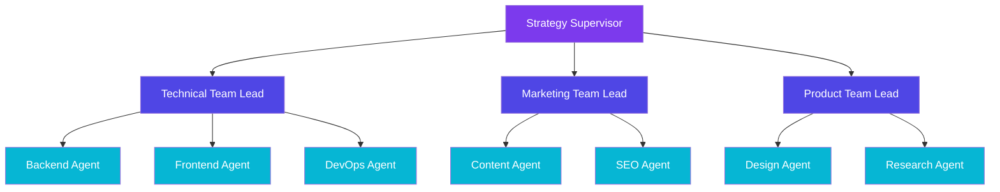
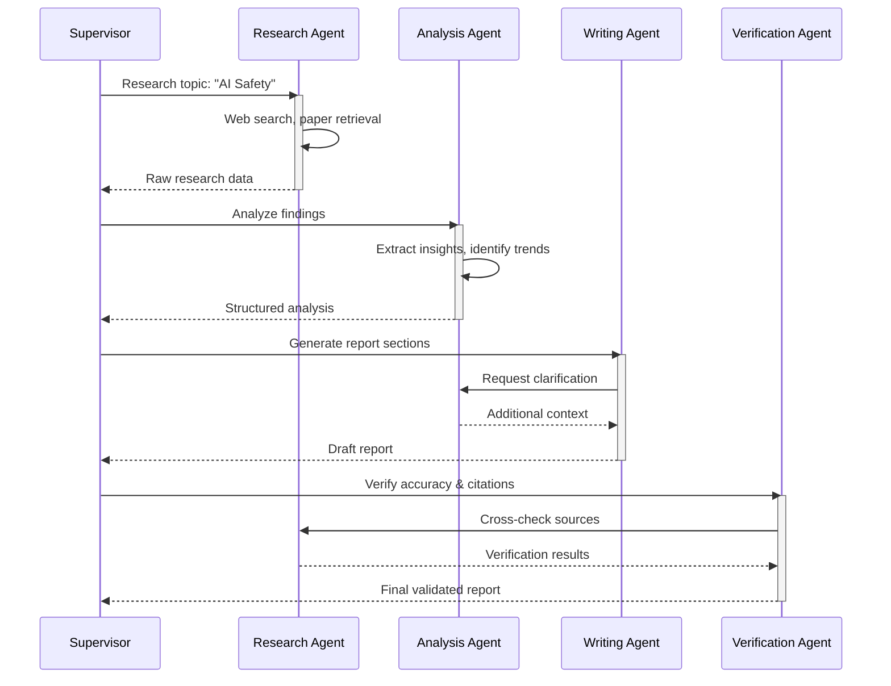
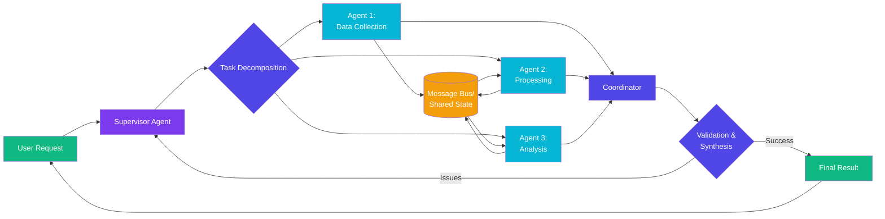

# Multi-Agent Systems
Agent Collaboration & Coordination Patterns

---
layout: two-cols
---

# Multi-Agent Architecture Patterns

<div class="mt-4">

## Key Patterns

<v-clicks>

- **Supervisor Pattern** 🎯
  - Central coordinator delegates tasks
  - Manages workflow and dependencies

- **Peer-to-Peer** 🤝
  - Agents communicate directly
  - Decentralized decision-making

- **Hierarchical** 📊
  - Multi-level organization
  - Specialized teams per domain

- **Swarm Intelligence** 🐝
  - Emergent collective behavior
  - Self-organizing systems

</v-clicks>

</div>

::right::

<div class="mt-12 ml-4">



<div class="text-sm mt-4 opacity-75">
Supervisor pattern with peer communication
</div>

</div>

---
layout: default
---

# Agent Communication & Coordination

<div class="grid grid-cols-2 gap-8 mt-8">

<div>

## Communication Methods

<v-clicks>

1. **Message Passing**
   ```python
   await agent.send_message(
       recipient="analyzer",
       content={"data": results},
       priority="high"
   )
   ```

2. **Shared Memory/State**
   - Blackboard architecture
   - Distributed cache
   - Event streams

3. **Direct Function Calls**
   - Synchronous coordination
   - Tight coupling

</v-clicks>

</div>

<div>

## Coordination Strategies

<v-clicks>

- **Task Decomposition**
  - Break complex goals into subtasks
  - Assign to specialized agents

- **Conflict Resolution**
  - Voting mechanisms
  - Priority-based arbitration
  - Consensus protocols

- **Load Balancing**
  - Dynamic task allocation
  - Resource optimization

- **State Synchronization**
  - Eventual consistency
  - Event sourcing

</v-clicks>

</div>

</div>

---
layout: default
---

# Supervisor & Hierarchical Patterns

<div class="grid grid-cols-2 gap-6 mt-4">

<div>

### Supervisor Pattern

```python
class SupervisorAgent:
    def __init__(self):
        self.agents = {
            'researcher': ResearchAgent(),
            'analyzer': AnalysisAgent(),
            'writer': WriterAgent()
        }
    
    async def execute_task(self, task):
        # Decompose task
        plan = self.create_plan(task)
        
        # Delegate to agents
        for step in plan:
            agent = self.agents[step.agent]
            result = await agent.execute(
                step.task,
                context=self.shared_context
            )
            self.shared_context.update(result)
        
        return self.synthesize_results()
```

<div class="mt-4 text-sm">

**Benefits:**
- Clear control flow
- Easy to debug and monitor
- Scalable delegation

</div>

</div>

<div>

### Hierarchical Architecture



<div class="mt-4 text-sm opacity-75">
Multi-level specialization with team leads
</div>

</div>

</div>

---
layout: default
---

# Collaborative Task Solving

<div class="mt-4">

## Example: Research Report Generation



</div>

<div class="mt-4 grid grid-cols-3 gap-4 text-sm">

<div class="bg-blue-500/10 p-3 rounded">
<strong>Parallelization</strong><br/>
Independent tasks run concurrently
</div>

<div class="bg-green-500/10 p-3 rounded">
<strong>Specialization</strong><br/>
Each agent has domain expertise
</div>

<div class="bg-purple-500/10 p-3 rounded">
<strong>Validation</strong><br/>
Cross-agent verification loops
</div>

</div>

---
layout: two-cols
---

# Real-World Use Cases

<div class="mt-4">

<v-clicks>

## 1. **Software Development**
- Planning agent decomposes features
- Code generation agents per module
- Testing agent validates output
- Integration agent merges work

## 2. **Customer Support**
- Routing agent classifies queries
- Specialist agents per domain
- Escalation to human supervisors
- Knowledge base maintenance

## 3. **Financial Analysis**
- Data collection agents (markets, news)
- Analysis agents (technical, fundamental)
- Risk assessment agent
- Report generation agent

</v-clicks>

</div>

::right::

<div class="mt-4 ml-4">

<v-clicks>

## 4. **Scientific Research**
- Literature review agents
- Experiment design agents
- Data analysis agents
- Hypothesis generation agents

## 5. **Content Creation**
- Research & fact-gathering
- Outline & structure planning
- Writing & editing
- SEO & optimization
- Multi-platform publishing

## 6. **Healthcare Diagnostics**
- Symptom analysis agents
- Medical history reviewers
- Diagnostic recommendation
- Treatment planning
- Drug interaction checking

</v-clicks>

</div>

---
layout: center
---

# Multi-Agent Interaction Flow

<div class="flex justify-center items-center mt-8">



</div>

<div class="mt-6 text-center text-sm opacity-75">
Complete workflow: decomposition → parallel execution → coordination → synthesis
</div>
