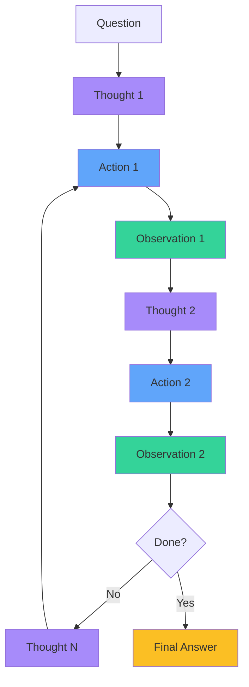

# ReAct Agents
## Reasoning + Acting

<div class="text-xl mt-8">
Synergizing reasoning and acting in language models
</div>

<div class="mt-12 text-gray-400">
ReAct combines chain-of-thought reasoning with action-taking capabilities
</div>

---
layout: two-cols
---

# The ReAct Framework

<div class="mt-4">

**Core Concept**: Interleave reasoning traces with task-specific actions

<div class="mt-8">

### Key Components

- **Thought** 💭: Reasoning step about the current state
- **Action** 🎯: Tool/API call to gather information
- **Observation** 👁️: Result from the action

</div>

<div class="mt-8">

### Why ReAct?

<v-clicks>

- Enables **dynamic reasoning** over multiple steps
- Grounds reasoning in **external knowledge**
- More **interpretable** than pure reasoning
- Reduces **hallucination** through verification

</v-clicks>

</div>

</div>

::right::

<div class="ml-8 mt-16">



<div class="text-sm text-gray-400 mt-4">
The ReAct loop: continuous reasoning and action
</div>

</div>

---

# ReAct in Action
## Example Trace Walkthrough

<div class="text-sm mt-4">

**Question**: *"What is the elevation of the highest peak in the country where the 2024 Olympics will be held?"*

</div>

<div class="mt-6 space-y-4">

<div v-click class="p-4 bg-purple-500/10 border-l-4 border-purple-500 rounded">
<div class="font-bold text-purple-400">Thought 1:</div>
<div class="text-sm mt-1">I need to first find out which country is hosting the 2024 Olympics.</div>
</div>

<div v-click class="p-4 bg-blue-500/10 border-l-4 border-blue-500 rounded">
<div class="font-bold text-blue-400">Action 1:</div>
<div class="text-sm mt-1 font-mono">search("2024 Olympics host country")</div>
</div>

<div v-click class="p-4 bg-green-500/10 border-l-4 border-green-500 rounded">
<div class="font-bold text-green-400">Observation 1:</div>
<div class="text-sm mt-1">The 2024 Summer Olympics will be held in Paris, France.</div>
</div>

<div v-click class="p-4 bg-purple-500/10 border-l-4 border-purple-500 rounded">
<div class="font-bold text-purple-400">Thought 2:</div>
<div class="text-sm mt-1">Now I know it's France. I need to find the highest peak in France.</div>
</div>

<div v-click class="p-4 bg-blue-500/10 border-l-4 border-blue-500 rounded">
<div class="font-bold text-blue-400">Action 2:</div>
<div class="text-sm mt-1 font-mono">search("highest peak in France")</div>
</div>

</div>

---

# ReAct Trace (continued)

<div class="space-y-4">

<div class="p-4 bg-green-500/10 border-l-4 border-green-500 rounded">
<div class="font-bold text-green-400">Observation 2:</div>
<div class="text-sm mt-1">The highest peak in France is Mont Blanc.</div>
</div>

<div v-click class="p-4 bg-purple-500/10 border-l-4 border-purple-500 rounded">
<div class="font-bold text-purple-400">Thought 3:</div>
<div class="text-sm mt-1">I found the peak name. Now I need to get its elevation.</div>
</div>

<div v-click class="p-4 bg-blue-500/10 border-l-4 border-blue-500 rounded">
<div class="font-bold text-blue-400">Action 3:</div>
<div class="text-sm mt-1 font-mono">search("Mont Blanc elevation")</div>
</div>

<div v-click class="p-4 bg-green-500/10 border-l-4 border-green-500 rounded">
<div class="font-bold text-green-400">Observation 3:</div>
<div class="text-sm mt-1">Mont Blanc has an elevation of 4,808 meters (15,774 feet).</div>
</div>

<div v-click class="p-4 bg-yellow-500/10 border-l-4 border-yellow-500 rounded">
<div class="font-bold text-yellow-400">Thought 4:</div>
<div class="text-sm mt-1">I now have all the information needed to answer the question.</div>
</div>

<div v-click class="p-4 bg-yellow-500/20 border-l-4 border-yellow-400 rounded">
<div class="font-bold text-yellow-300">Final Answer:</div>
<div class="text-sm mt-1">The elevation of the highest peak (Mont Blanc) in France, the country hosting the 2024 Olympics, is 4,808 meters (15,774 feet).</div>
</div>

</div>

---

# Implementation in LangChain
## Building a ReAct Agent

<div class="grid grid-cols-2 gap-8 mt-8">

<div>

### Setup & Tools

```python {all|1-3|5-11|13-18|all}
from langchain.agents import initialize_agent
from langchain.agents import AgentType
from langchain.llms import OpenAI

# Define tools the agent can use
from langchain.tools import Tool
from langchain.utilities import GoogleSearchAPIWrapper

search = GoogleSearchAPIWrapper()
search_tool = Tool(
    name="Search",
    func=search.run,
    description="Search for current information"
)

calculator_tool = Tool(
    name="Calculator",
    func=lambda x: eval(x),
    description="Perform math calculations"
)
```

</div>

<div>

### Initialize Agent

```python {all|1-2|4-8|10-11|all}
# Create ReAct agent
llm = OpenAI(temperature=0)

agent = initialize_agent(
    tools=[search_tool, calculator_tool],
    llm=llm,
    agent=AgentType.REACT_DOCSTORE,
    verbose=True  # See the reasoning!
)

# Run the agent
response = agent.run(
    "What is the square root of the year "
    "the Eiffel Tower was completed?"
)
```

<div class="mt-4 p-3 bg-blue-500/10 rounded text-sm">
<div class="font-bold text-blue-400">Output includes:</div>
<div class="mt-2 text-xs">
✓ Thought traces<br>
✓ Action selection<br>
✓ Observations<br>
✓ Final answer
</div>
</div>

</div>

</div>

---

# Complete ReAct Agent Example

```python {all|1-5|7-27|29-41|43-51|all}
from langchain.agents import Tool, AgentExecutor, create_react_agent
from langchain_openai import ChatOpenAI
from langchain.prompts import PromptTemplate
from langchain.tools import DuckDuckGoSearchRun
import math

# Define custom tools
def calculator(expression: str) -> str:
    """Evaluate a mathematical expression."""
    try:
        result = eval(expression, {"__builtins__": {}}, 
                     {"math": math, "sqrt": math.sqrt})
        return f"Result: {result}"
    except Exception as e:
        return f"Error: {str(e)}"

tools = [
    Tool(
        name="Search",
        func=DuckDuckGoSearchRun().run,
        description="Search the internet for current information. "
                    "Input should be a search query."
    ),
    Tool(
        name="Calculator",
        func=calculator,
        description="Calculate math expressions. Input: valid Python expression."
    ),
]

# ReAct prompt template
react_prompt = PromptTemplate.from_template("""
Answer the following question using this format:

Thought: Consider what you need to do next
Action: Choose from [{tool_names}]
Action Input: The input for the action
Observation: The result of the action
... (repeat Thought/Action/Observation as needed)
Thought: I now know the final answer
Final Answer: The final answer to the question

Question: {input}
{agent_scratchpad}
""")

# Create and run agent
llm = ChatOpenAI(model="gpt-4", temperature=0)
agent = create_react_agent(llm, tools, react_prompt)
agent_executor = AgentExecutor(
    agent=agent, 
    tools=tools, 
    verbose=True,
    handle_parsing_errors=True
)

# Execute
result = agent_executor.invoke({
    "input": "What is the population of Tokyo multiplied by 0.15?"
})
print(f"\n🎯 Final Answer: {result['output']}")
```

<div class="absolute bottom-8 right-8 text-sm text-gray-400">
Full working ReAct implementation with search and calculation tools
</div>
