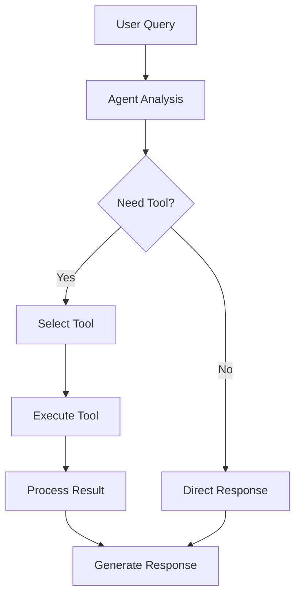

# Tools & Memory Systems
Building Capable AI Agents

---
layout: two-cols
---

# What are Tools?

<div v-click>

**Tools** are functions that agents can call to:
- Access external information
- Perform computations
- Interact with APIs and services
- Execute actions in the real world

</div>

<div v-click>

### Why Tools Matter
- Extend agent capabilities beyond text generation
- Enable agents to access real-time data
- Allow interaction with external systems
- Make agents more reliable and grounded

</div>

::right::

<div v-click>

### Tool Execution Flow



</div>

<div v-click class="mt-4">

**Example**: "What's the weather in Paris?"
1. Agent identifies need for weather tool
2. Calls `get_weather(city="Paris")`
3. Receives data and formulates answer

</div>

---

# Tool Definition & Usage

<div class="grid grid-cols-2 gap-4">

<div>

### Defining a Tool

```python {all|1-3|5-11|13-18|all}
from langchain.tools import tool
from typing import Optional
import requests

@tool
def search_web(query: str) -> str:
    """
    Search the web for information.
    Args: query - The search query string
    """
    # Implementation here
    return f"Search results for: {query}"

@tool
def calculator(expression: str) -> float:
    """Evaluate a mathematical expression."""
    return eval(expression)
```

<div v-click class="mt-2 text-sm text-gray-400">

💡 Clear descriptions help agents choose the right tool

</div>

</div>

<div>

### Using Tools with Agents

```python {all|1-4|6-11|13-16|all}
from langchain.agents import create_react_agent
from langchain_openai import ChatOpenAI
from langchain.prompts import PromptTemplate
from langchain.agents import AgentExecutor

# Define tools list
tools = [
    search_web,
    calculator,
    # ... more tools
]

# Create agent with tools
llm = ChatOpenAI(temperature=0)
agent = create_react_agent(llm, tools, prompt)
agent_executor = AgentExecutor(agent=agent, tools=tools)

# Execute
response = agent_executor.invoke({
    "input": "What is 25 * 17?"
})
```

</div>

</div>

---

# Types of Tools

<div class="grid grid-cols-2 gap-6">

<div>

### 🔍 Search & Retrieval
```python
@tool
def google_search(query: str) -> str:
    """Search Google for current information"""
    # Use SerpAPI or similar
    return search_results

@tool
def wikipedia_lookup(topic: str) -> str:
    """Get Wikipedia summary"""
    import wikipedia
    return wikipedia.summary(topic)
```

### 🧮 Computation
```python
@tool
def calculator(expr: str) -> float:
    """Perform calculations"""
    return eval(expr)

@tool
def python_repl(code: str) -> str:
    """Execute Python code"""
    exec(code)
    return result
```

</div>

<div>

### 🌐 API Integration
```python
@tool
def get_weather(city: str) -> dict:
    """Get current weather"""
    api_url = f"api.weather.com/{city}"
    return requests.get(api_url).json()

@tool
def send_email(to: str, subject: str) -> bool:
    """Send email via SMTP"""
    # Email implementation
    return True
```

### 🛠️ Custom Domain Tools
```python
@tool
def query_database(sql: str) -> list:
    """Query company database"""
    return db.execute(sql)

@tool
def create_ticket(issue: str) -> str:
    """Create support ticket"""
    return ticket_system.create(issue)
```

</div>

</div>

<div v-click class="mt-4 p-4 bg-blue-500/10 rounded">

**Best Practice**: Start with 3-5 well-defined tools. Too many tools can confuse the agent!

</div>

---

# Memory in AI Agents

<div class="grid grid-cols-3 gap-4">

<div v-click>

### 💬 Conversation Buffer
**Stores recent messages**

```python
from langchain.memory import (
    ConversationBufferMemory
)

memory = ConversationBufferMemory(
    return_messages=True
)

# Automatically stores:
# - User inputs
# - Agent responses
# - Tool calls & results
```

**Pros**: Simple, complete context  
**Cons**: Grows unbounded

</div>

<div v-click>

### 📝 Summary Memory
**Condenses conversation**

```python
from langchain.memory import (
    ConversationSummaryMemory
)

memory = ConversationSummaryMemory(
    llm=llm,
    max_token_limit=500
)

# Periodically summarizes:
# "User asked about weather.
#  Agent used weather tool.
#  Provided forecast for NYC."
```

**Pros**: Bounded size  
**Cons**: May lose details

</div>

<div v-click>

### 🗄️ Vector Store Memory
**Semantic search over history**

```python
from langchain.memory import (
    VectorStoreRetrieverMemory
)
from langchain.vectorstores import FAISS

vectorstore = FAISS.from_texts(
    [], embedding_model
)

memory = VectorStoreRetrieverMemory(
    retriever=vectorstore.as_retriever(
        search_kwargs={"k": 3}
    )
)

# Retrieves relevant past 
# interactions based on
# semantic similarity
```

**Pros**: Scales well, contextual  
**Cons**: More complex

</div>

</div>

---

# How Memory Enhances Agents

<div class="grid grid-cols-2 gap-6">

<div>

### Without Memory 😞

```python
agent = create_agent(tools=tools)

# First query
agent.invoke({"input": "My name is Alice"})
# Response: "Hello Alice!"

# Second query
agent.invoke({"input": "What's my name?"})
# Response: "I don't know your name."
```

<div v-click class="mt-4 text-red-400">

❌ No context between conversations  
❌ Can't build on previous interactions  
❌ Must repeat information

</div>

</div>

<div>

### With Memory 🎉

```python
memory = ConversationBufferMemory()
agent = create_agent(
    tools=tools,
    memory=memory
)

# First query
agent.invoke({"input": "My name is Alice"})
# Response: "Hello Alice!"
# [Stored in memory]

# Second query
agent.invoke({"input": "What's my name?"})
# Response: "Your name is Alice!"
```

<div v-click class="mt-4 text-green-400">

✅ Maintains conversation context  
✅ Learns user preferences  
✅ More natural interactions

</div>

</div>

</div>

<div v-click class="mt-6 p-4 bg-purple-500/10 rounded">

**Real-world benefit**: Memory allows agents to have multi-turn conversations, remember user preferences, and build rapport over time.

</div>

---

# Complete Implementation Example

```python {all|1-8|10-24|26-38|40-47|all}
from langchain.agents import create_react_agent, AgentExecutor
from langchain_openai import ChatOpenAI
from langchain.memory import ConversationBufferMemory
from langchain.tools import tool
from langchain import hub
import requests

# 1. Define Tools
@tool
def get_weather(city: str) -> str:
    """Get current weather for a city."""
    # Simulated API call
    weather_data = {
        "New York": "Sunny, 72°F",
        "London": "Rainy, 15°C",
        "Tokyo": "Cloudy, 20°C"
    }
    return weather_data.get(city, "Weather data not available")

@tool
def calculator(expression: str) -> str:
    """Calculate mathematical expressions."""
    try:
        return str(eval(expression))
    except Exception as e:
        return f"Error: {str(e)}"

# 2. Setup Memory
memory = ConversationBufferMemory(
    memory_key="chat_history",
    return_messages=True
)

# 3. Create Agent
llm = ChatOpenAI(model="gpt-4", temperature=0)
tools = [get_weather, calculator]
prompt = hub.pull("hwchase17/react")
agent = create_react_agent(llm, tools, prompt)

# 4. Execute with Memory
agent_executor = AgentExecutor(
    agent=agent,
    tools=tools,
    memory=memory,
    verbose=True
)

# 5. Multi-turn Conversation
print(agent_executor.invoke({"input": "What's the weather in Tokyo?"}))
# Agent uses get_weather tool

print(agent_executor.invoke({"input": "Convert that temperature to Fahrenheit"}))
# Agent remembers previous context and uses calculator

print(agent_executor.invoke({"input": "Is it warmer in New York?"}))
# Agent uses weather tool and compares with remembered information
```

---
layout: two-cols
---

# Key Takeaways

<div v-click>

### 🔧 Tools

- Extend LLM capabilities with actions
- Define clear descriptions & parameters
- Start simple, add complexity gradually
- Common types: search, compute, API, custom

</div>

<div v-click class="mt-6">

### 🧠 Memory

- Enables context across interactions
- Multiple types for different needs:
  - **Buffer**: Complete recent history
  - **Summary**: Condensed context
  - **Vector**: Semantic retrieval
- Critical for conversational agents

</div>

::right::

<div v-click>

### 🎯 Best Practices

```python
# ✅ Good Tool Design
@tool
def search_product(
    product_name: str,
    category: Optional[str] = None
) -> dict:
    """
    Search for products in inventory.
    
    Args:
        product_name: Name of the product
        category: Optional category filter
    
    Returns:
        Product details including price
        and availability
    """
    pass

# ✅ Good Memory Setup
memory = ConversationSummaryMemory(
    llm=llm,
    max_token_limit=1000,
    return_messages=True
)
```

</div>

<div v-click class="mt-6 p-3 bg-green-500/10 rounded text-sm">

**Next Steps**: Combine tools + memory to build production-ready agents that can handle complex, multi-step tasks while maintaining context!

</div>

