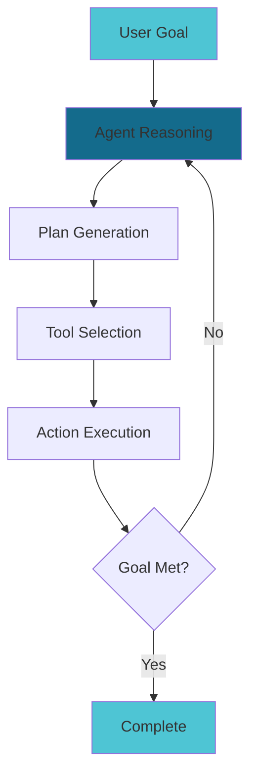
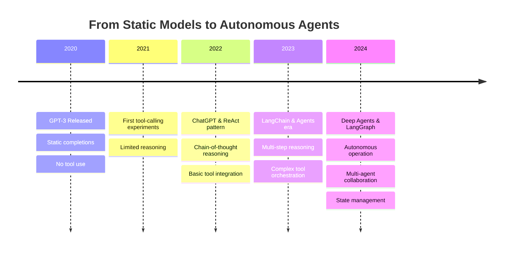

# Deep Agents by LangChain

## Building Autonomous AI Systems

  A comprehensive guide to creating intelligent, reasoning agents

  
Press Space to continue →

<!--
Welcome to this comprehensive presentation on Deep Agents by LangChain - a journey into building autonomous AI systems that can reason, plan, and act.
-->

---
transition: fade-out
layout: two-cols
layoutClass: gap-8
---

# What are Deep Agents?

**Deep agents** are advanced AI systems that combine:

- 🧠 **Reasoning** - Complex problem-solving capabilities
- 🎯 **Planning** - Multi-step task decomposition
- 🔧 **Tool Use** - Interact with external systems & APIs
- 🔄 **Iteration** - Self-correction and refinement
- 🤖 **Autonomy** - Minimal human intervention
- 💾 **Memory** - Learn from past interactions

Unlike simple chatbots, deep agents can independently pursue complex goals over extended periods.

::right::

<!--
Deep agents represent a paradigm shift from passive AI to active, autonomous systems that can pursue complex goals through reasoning and action.
-->

---
layout: default
---

# The Evolution of AI Systems

The journey from simple text generation to autonomous agents capable of complex reasoning and action.

<!--
We've witnessed a rapid evolution from static language models to sophisticated agents that can reason, plan, and execute complex tasks autonomously.
-->

---
layout: center
class: text-center
---

# Why LangChain?

  
🔗

  
Orchestration

  
Connect LLMs, tools, and data sources seamlessly

  
🏗️

  
Framework

  
Production-ready components and abstractions

  
🚀

  
Ecosystem

  
Rich integrations and community support

  LangChain provides the **foundation** for building production-ready AI agents

<!--
LangChain has become the de facto standard for building agent systems, providing robust tools and abstractions for orchestrating complex AI workflows.
-->

---
src: ./pages/langchain-fundamentals.md
---

---
src: ./pages/agent-concepts.md
---

---
src: ./pages/agent-architecture.md
---

---
src: ./pages/tools-and-memory.md
---

---
src: ./pages/react-agents.md
---

---
src: ./pages/agent-types.md
---

---
src: ./pages/langgraph-intro.md
---

---
src: ./pages/multi-agent-systems.md
---

---
src: ./pages/code-examples.md
---

---
src: ./pages/best-practices.md
---

---
src: ./pages/deployment.md
---

---
layout: center
class: text-center
---

# Thank You!

  Questions?

  

    
Resources:

    

      • LangChain Docs: python.langchain.com 
      • LangGraph: langchain-ai.github.io/langgraph 
      • GitHub: github.com/langchain-ai
    

  

  

    
Community:

    

      • Discord: discord.gg/langchain 
      • Twitter: @LangChainAI 
      • Blog: blog.langchain.dev
    

  

<!--
Thank you for joining this deep dive into LangChain agents. The future of AI is autonomous, and you're now equipped to build it!
-->
